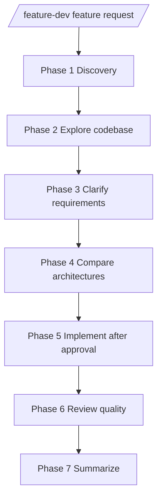

# opencode-feature-dev

OpenCode plugin that ports the Claude Code `feature-dev` workflow into OpenCode.

## What it does

- Intercepts `/feature-dev ...`
- Injects a 7-phase guided workflow
- Embeds `code-explorer`, `code-architect`, and `code-reviewer` role prompts
- Encourages parallel delegation during exploration, architecture, and review

## Current scope

This is an MVP port focused on workflow orchestration.

- Works best when `opencode-background-agents` is also installed
- Uses prompt injection rather than dynamic command/agent registration
- Adapts Claude-specific roles to OpenCode's existing tools and subagents

## Install

Add the plugin to your OpenCode config:

```json
{
  "$schema": "https://opencode.ai/config.json",
  "plugin": ["opencode-feature-dev"]
}
```

Recommended companion plugin:

```json
{
  "$schema": "https://opencode.ai/config.json",
  "plugin": [
    "opencode-background-agents",
    "opencode-feature-dev"
  ]
}
```

Restart OpenCode after updating config.

## Usage

```text
/feature-dev Add OAuth login to the app
```

The plugin guides the agent through:

1. Discovery
2. Codebase Exploration
3. Clarifying Questions
4. Architecture Design
5. Implementation
6. Quality Review
7. Summary

## Mermaid flow



## Limitations

- This is not a byte-for-byte clone of Claude Code plugin packaging.
- OpenCode plugin APIs differ, so this port clones the workflow behavior rather than the exact file layout.
- If `/feature-dev` command execution behavior changes in OpenCode, the interception hook may need updating.

## Development

```bash
npm install
npm run typecheck
npm run build
```
